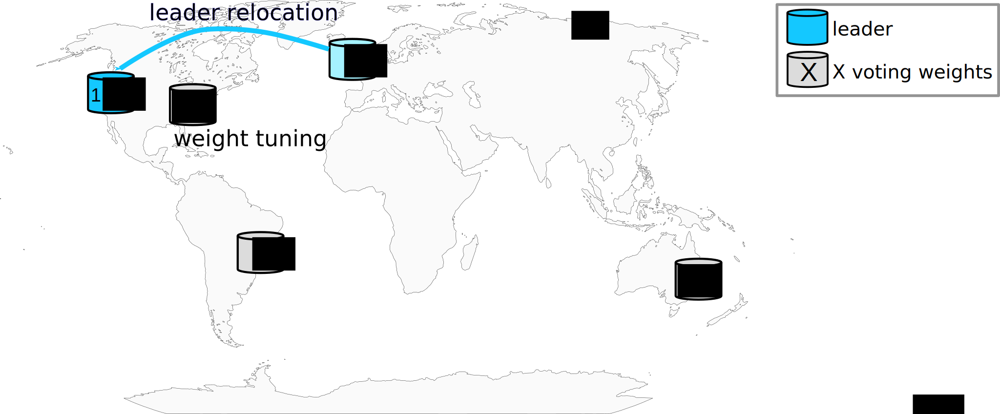

AWARE 0.2
----------

**A**daptive **W**ide-**A**rea **RE**plication


With the rise of new blockchain systems, Byzantine consensus is getting practical and necessary with world-spanning replica deployments. 

In geo-distributed systems, the pace at which consensus is achieved is limited by the latencies of links between replicas. Consensus-based systems can benefit from **weighted replication** (see **WHEAT** below), an approach that
assigns higher voting weights to a clique of fast (well-connected) replicas. This allows to leverage proportionally smaller quorums to make progress, thus decreasing the latency of reaching consensus in a system.

We incorporate the idea of continous self-optimization into geographically distributed, weighted replication by introducing **AWARE**,
an automated and dynamic voting weight tuning and leader positioning scheme. AWARE **monitors** the link latencies of replicas and employs a prediction model, thriving to **continously optimize** the system’s **consensus latency**.


<p align="center">
    
</p>

A **technical description** of AWARE can be found in the **IEEE TDSC'20** paper:

[AWARE: Adaptive Wide-Area Replication for
Fast and Resilient Byzantine Consensus](https://www.di.fc.ul.pt/~bessani/publications/tdsc20-aware.pdf):


This branch contains the sources of AWARE, an automated voting weight tuning and leader positioning scheme that implements the optimizations and vote assignment schemes of WHEAT [1] and dynamically allows the system to adjust itself to the best possible configuration.


In the configuration file, you can use the following options to enable AWARE's optimizations:

```
system.aware.useDynamicWeights = true
system.aware.useLeaderSelection = true
```

Deploy AWARE in any starting configuration. It will automatically start monitoring and self-optimizing.


WHEAT 0.2-alpha
----------

This branch contains the source code for WHEAT, an extension of BFT-SMART (based on version 1.1-beta) that implements the optimizations and vote assignment schemes described in [1]. It can be lanuched in the same way as the standard library. 

## Example (for the counter demo):

$ java -cp ./bin/*:./lib/* bftsmart.demo.counter.CounterServer 0
$ java -cp ./bin/*:./lib/* bftsmart.demo.counter.CounterServer 1
$ java -cp ./bin/*:./lib/* bftsmart.demo.counter.CounterServer 2
$ java -cp ./bin/*:./lib/* bftsmart.demo.counter.CounterServer 3
$ java -cp ./bin/*:./lib/* bftsmart.demo.counter.CounterServer 4

$ java -cp ./bin/*:./lib/* bftsmart.demo.counter.CounterClient 1001 10

To configure the vote assigment scheme, it is necessary to:

1) sort the replicas IDs from fastest to slowest in ./config/system.config;
2) set the "useWeights" parameter to "true".

Example for 5 replicas (BFT mode, f = 1, delta = 1):

system.initial.view = 4,0,1,2,3
system.useweights = true

The code will automatically compute the values delta, u and Vmax discussed in [1] during start-up. Bear in mind that this code is highly experimental, and only runned in fault-free executions.

To activate tentative executions:

system.tentative=true

Finally, do not forget to always erase the ./config/currentView file after changing N, F, or the order of replicas. This file stores information about the system view, and if it exists, WHEAT/SMART assumes the data from that file instead of creating it again from the settings available in the configuration files.

Feel free to contact us if you have any questions!

References:
[1] J. Sousa and A. Bessani // Separating the WHEAT from the Chaff: An Empirical Design for Geo-Replicated State Machines // SRDS'15


# Byzantine Fault-Tolerant (BFT) State Machine Replication (SMaRt) v1.2

This is a Byzantine fault-tolerant state machine replication project named BFT-SMaRt, a Java open source library maintained by the LaSIGE research unit at the University of Lisbon.

This package contains the source code (src/), jar file (bin/BFT-SMaRt.jar), dependencies (lib/), documentation (doc/), running scripts (runscripts/), and configuration files (config/) for version 1.2 of the project.
BFT-SMaRt requires the Java Runtime Environment version 1.8 or later.

## Quick start

To run any demonstration you first need to configure BFT-SMaRt to define the protocol behavior and the location of each replica.

The servers must be specified in the configuration file (see `config/hosts.config`):

```
#server id, address and port (the ids from 0 to n-1 are the service replicas) 
0 127.0.0.1 11000 11001
1 127.0.0.1 11010 11011
2 127.0.0.1 11020 11021
3 127.0.0.1 11030 11031
```

**Important tip #1:** Always provide IP addresses instead of hostnames. If a machine running a replica is not correctly configured, BFT-SMaRt may fail to bind to the appropriate IP address and use the loopback address instead (127.0.0.1). This phenomenom may prevent clients and/or replicas from successfully establishing a connection among them.

**Important tip #2:** Clients requests should not be issued before all replicas have been properly initialized. Replicas are ready to process client requests when each one outputs `-- Ready to process operations` in the console.

The system configurations also have to be specified (see`config/system.config`). Most of the parameters are self explanatory.

**Important tip #3:** When using the library in real systems, always make sure to set `system.communication.defaultkeys` to `false` and `system.communication.useSignatures` to `1`. Also make sure that only the `config/keys` directory only has the private key for the repective replica/client.

You can run the counter demonstration by executing the following commands, from within the main directory across four different consoles (4 replicas, to tolerate 1 fault):

```
./runscripts/smartrun.sh bftsmart.demo.counter.CounterServer 0
./runscripts/smartrun.sh bftsmart.demo.counter.CounterServer 1
./runscripts/smartrun.sh bftsmart.demo.counter.CounterServer 2
./runscripts/smartrun.sh bftsmart.demo.counter.CounterServer 3
```

**Important tip #4:** If you are getting timeout messages, it is possible that the application you are running takes too long to process the requests or the network delay is too high and PROPOSE messages from the leader does not arrive in time, so replicas may start the leader change protocol. To prevent that, try to increase the `system.totalordermulticast.timeout` parameter in 'config/system.config'.

**Important tip #5:** Never forget to delete the `config/currentView` file after you modify `config/hosts.config` or `config/system.config`. If `config/currentView` exists, BFT-SMaRt always fetches the group configuration from this file first. Otherwise, BFT-SMaRt fetches information from the other files and creates `config/currentView` from scratch. Note that `config/currentView` only stores information related to the group of replicas. You do not need to delete this file if, for instance, you want to enable the debugger or change the value of the request timeout.

Once all replicas are ready, the client can be launched as follows:

```
./runscripts/smartrun.sh bftsmart.demo.counter.CounterClient 1001 <increment> [<number of operations>]
```

If `<increment>` equals 0 the request will be read-only. Default `<number of operations>` equals 1000.

**Important tip #6:** always make sure that each client uses a unique ID. Otherwise, clients may not be able to complete their operations.
  
## State transfer protocol(s)

BFT-SMaRt offers two state transfer protocols. The first is a basic protocol that can be used by extending the classes `bftsmart.tom.server.defaultservices.DefaultRecoverable` and `bftsmart.tom.server.defaultservices.DefaultSingleRecoverable`. Thee classes logs requests into memory and periodically takes snapshots of the application state.

The second, more advanced protocol can be used by extending the class 
`bftsmart.tom.server.defaultservices.durability.DurabilityCoordinator`. This protocol stores its logs to disk. To mitigate the latency of writing to disk, such tasks is done in batches and in parallel with the requests' execution. Additionally, the snapshots are taken at different points of the execution in different replicas.

**Important tip #7:** We recommend developers to use `bftsmart.tom.server.defaultservices.DefaultRecoverable`, since it is the most stable of the three classes.

**Important tip #8:** regardless of the chosen protocol, developers must avoid using Java API objects like `HashSet` or `HashMap`, and use `TreeSet` or `TreeMap` instead. This is because serialization of Hash* objects is not deterministic, i.e, it generates different byte arrays for equal objects. This will lead to problems after more than `f` replicas used the state transfer protocol to recover from failures.

## Group reconfiguration

The library also implements a reconfiguration protocol that can be used to add/remove replicas from the initial group. You can add/remove replicas on-the-fly by executing the following commands:

```
./runscripts/smartrun.sh bftsmart.reconfiguration.util.DefaultVMServices <smart id> <ip address> <port> (to add a replica to the group)
./runscripts/smartrun.sh bftsmart.reconfiguration.util.DefaultVMServices <smart id> (to remove a replica from the group)
```

**Important tip #9:** everytime you use the reconfiguration protocol, you must make sure that all replicas and the host where you invoke the above commands have the latest `config/currentView` file. The current implementation of BFT-SMaRt does not provide any mechanism to distribute this file, so you will need to distribute it on your own (e.g., using the `scp` command). You also need to make sure that any client that starts executing can read from the latest `config/currentView` file.

## BFT-SMaRt under crash faults

You can run BFT-SMaRt in crash-faults only mode by setting the `system.bft` parameter in the configuration file to `false`. This mode requires less replicas to execute, but will not withstand full Byzantine behavior from compromised replicas.

## Generating public/private key pairs

If you need to generate public/private keys for more replicas or clients, you can use the following command:

```
./runscripts/smartrun.sh bftsmart.tom.util.RSAKeyPairGenerator <id> <key size>
```

Keys are stored in the `config/keys` folder. The command above creates key pairs both for clients and replicas. Alternatively, you can set the `system.communication.defaultkeys` to `true` in the `config/system.config` file to forces all processes to use the same public/private keys pair and secret key. This is useful when deploying experiments and benchmarks, because it enables the programmer to avoid generating keys for all principals involved in the system. However, this must not be used in a real deployments.

## Compiling

**Before the integration of `gradle` (up to the commit `0f2d407`):**

Make sure that you have Ant installed and simply type `ant` in the main directory. The jar file is stored in the `bin/` directory.

**With `gradle` (after the commit `0f2d407`):**

Type `./gradlew installDist` in the main directory. The required jar files and default configuration files will be available in the `build/install/library` directory.

**WARNING:** You might need to give execution permission to the `gradlew` script.

## Additional information and publications

If you are interested in learning more about BFT-SMaRt, you can read:

- The paper about its state machine protocol published in [EDCC'12](http://www.di.fc.ul.pt/~bessani/publications/edcc12-modsmart.pdf):
- The paper about its advanced state transfer protocol published in [Usenix'13](http://www.di.fc.ul.pt/~bessani/publications/usenix13-dsmr.pdf):
- The tool description published in [DSN'14](http://www.di.fc.ul.pt/~bessani/publications/dsn14-bftsmart.pdf):

***Feel free to contact us if you have any questions!***
